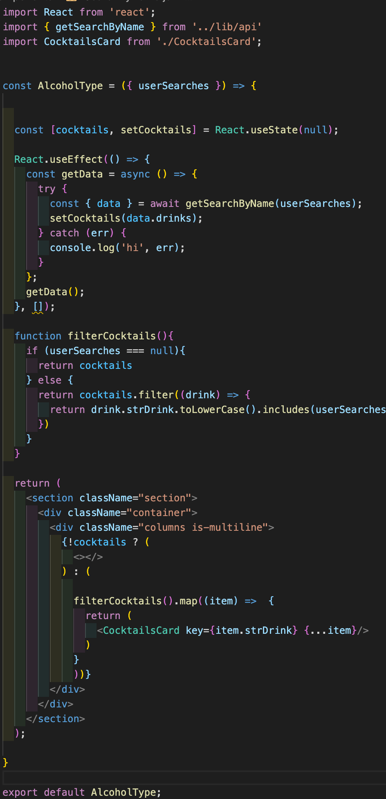

# Project Two

https://fetchmeadrink.netlify.app/

Team size: 2

## Table of contents

<li>Project Overview</li>
<li>The Brief</li>
<li>Technologies Used</li>
<li>Approach Taken - (screenshots and featured code)</li>
<li>Wins & Blockers</li>
<li>Bugs</li>
<li>Future Content and Improvements</li>
<li>Key Learnings</li>

## Project Overview

Coctailz is an app which showcases a wide list of cocktail recipes using a public api. This project was built in 6 days alongside my partner. It was a pair coding hackathon where every day consisted of chatting through zoom from 9am - 5pm and coding using VS Code live share. The front-end was built using React JS. This was my first project ever using React and an API.

## The Brief

<li>Consume a public API – this could be anything but it must make sense for your project</li>
<li>Have several components - At least one classical and one functional</li>
<li>The app can have a router - with several "pages", this is up to your discretion and if it makes sense for your project</li>
<li>Include wireframes - that you designed before building the app</li>
<li>Be deployed online and accessible to the public</li>

## Technologies Used

Front-end:
<li>React</li>
<li>JSX</li>
<li>Axios</li>
<li>Bulma</li>
<li>SCSS</li>
<li>HTML5</li>
<li>React Router Dom</li>

API Used:

The Meal DB - https://www.thecocktaildb.com/api.php

Dev tools:
<li>VS code</li>
<li>Postman</li>
<li>Git</li>
<li>GitHub</li>
<li>Node</li>
<li>Excalidraw (Wireframeing)</li>
<li>Netlify (deployment)</li>

## Approach Taken

The first stage of this project was planning and dividing up the tasks using Excalidraw (wireframe). I was in charge of several key files inside the components folder, namely the; Navbar.js, SearchByName.js, CocktailsCard.js, and the Random.js as well as some of the styling. Teamwork and communication was very fluid and clear. Reason being, we were on a live zoom call from 9-5 every day which allowed us to plan in advance and help each other out in case we were stuck on some part of our tasks. Our ability to commnunicate is what helped us reach our goals the most. Using Node Package Manager (NPM) we spun up the front end and hooked it up to the back end using Axios requests.

Some code I am particularly proud of was building the search bar which required handling what the user searched for and filtering the API request for all the cocktails (showcased below).

## Wins & Blockers

Working as a team for the first time and building a project with React for the first time too, was challenging. The deployment turned out to be quite buggy as many links became broken using Netlify. 

I felt that we communicated very well and got very comfortable with React.js by the end of this project. We finished our most viable product (MVP) swiftly which left us with a lot of time to implement our stretch goals.

## Bugs

Despite the local port working perfectly, the deployment via Netlify caused some issues as many links became broken producing a 404 error. Another bug caused by Netlify was the 'Fetch Me a Drink' button in the navigation bar.

## Future Content and Improvements 

Some future content that could be added is registration and login pages where you can save your favourite cocktails. Having highlighted the bugs already in the section above, some other improvements can be better styling with Bulma.  

## Key Learnings

My key learnings from this project are that React and Node provide a local port that may not necessarily work when deploying with Netlify. Possibly the most important learning from this project was that I discovered I can work in a group well and divide up tasks fairly. Last but not least, I learnt how to create a React app using Node and can do some comfortably and reliably.